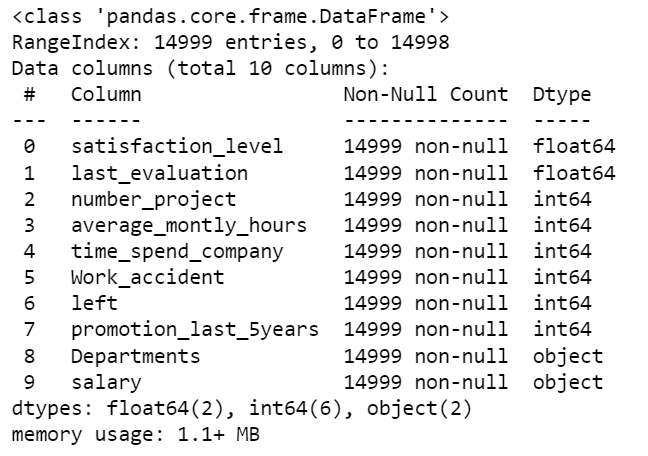
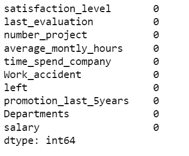
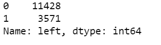
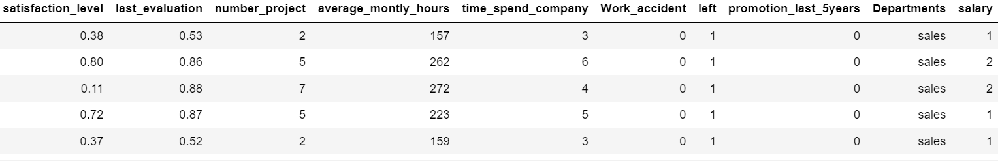
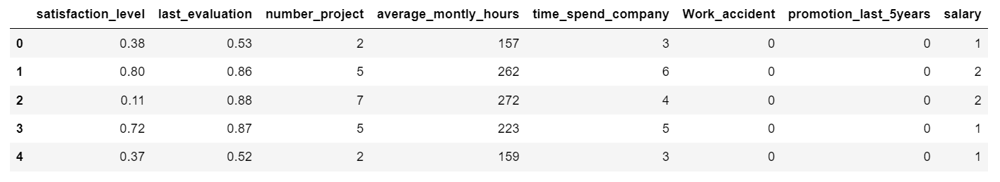
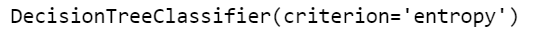

# Implementation-of-Decision-Tree-Classifier-Model-for-Predicting-Employee-Churn

## AIM:
To write a program to implement the Decision Tree Classifier Model for Predicting Employee Churn.

## Equipments Required:
1. Hardware – PCs
2. Anaconda – Python 3.7 Installation / Moodle-Code Runner

## Algorithm

### STEP 1:

Import the required libraries

### STEP 2:

 Upload and read the dataset.

### STEP 3:

Check for any null values using the isnull() function.

### STEP 4:

From sklearn.tree import DecisionTreeClassifier and use criterion as entropy.

### STEP 5:

 Find the accuracy of the model and predict the required values by importing the required module from sklearn.

## Program:
```python

Program to implement the Decision Tree Classifier Model for Predicting Employee Churn.
Developed by: PRANAVE B
RegisterNumber:  212221240040   

import pandas as pd
data=pd.read_csv("Employee.csv")
data.head()
data.info()
data.isnull().sum()
data["left"].value_counts()
from sklearn.preprocessing import LabelEncoder
le=LabelEncoder()
data["salary"]=le.fit_transform(data["salary"])
data.head()
X=data[["satisfaction_level","last_evaluation","number_project","average_montly_hours","time_spend_company","Work_accident","promotion_last_5years","salary"]]
X.head()
Y=data["left"]
from sklearn.model_selection import train_test_split
X_train,X_test,Y_train,Y_test=train_test_split(X,Y,test_size=0.2,random_state=100)
from sklearn.tree import DecisionTreeClassifier
dt=DecisionTreeClassifier(criterion="entropy")
dt.fit(X_train,Y_train)
Y_pred=dt.predict(X_test)
from sklearn import metrics
accuracy=metrics.accuracy_score(Y_test,Y_pred)
accuracy
dt.predict([[0.5,0.8,9,260,6,0,1,2]])

```

# Output:

## DATA HEAD:


## DATA INFO:



## DATA ISNULL:



## DATA LEFT:



## DATA HEAD:


## X.HEAD:


## dt.FIT:



## ACCURACY


## dt.PREDICT


## Result:
Thus the program to implement the  Decision Tree Classifier Model for Predicting Employee Churn is written and verified using python programming.
